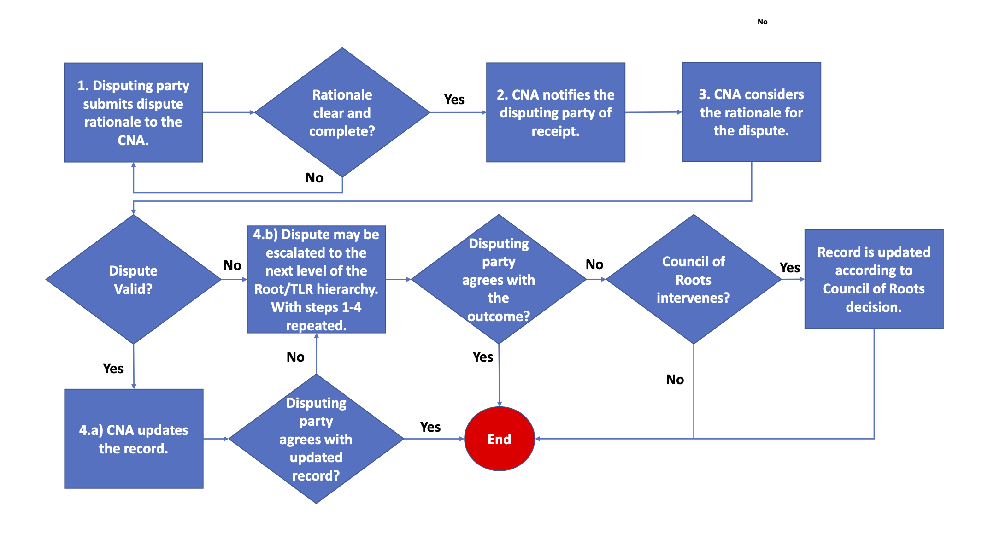

| Status | Final |
| ---: | --- |
| Version | 1.0 |
| Adopted | 2022-09-22 |
| Effective | 2022-09-22 |

# CVE Program Policy and Procedure for Disputing a CVE Record

This policy and procedure is enforced by [Roots](https://www.cve.org/ResourcesSupport/Glossary?activeTerm=glossaryRoot), [Top-Level Roots (TLR)](https://www.cve.org/ResourcesSupport/Glossary?activeTerm=glossaryTLRoot), and the Council of Roots (CoR).

## Definitions

* **Disputes:** Disagreements with the accuracy or completeness of a [CVE Record](https://www.cve.org/ResourcesSupport/Glossary?activeTerm=glossaryRecord), or the validity of a vulnerability upon which a CVE Record is based.

* **Escalation:** The process by which disputes are evaluated and resolved.

## Policy

It is the policy of the [CVE Program](https://www.cve.org/ResourcesSupport/Glossary?activeTerm=glossaryProgram) that all disputes be initiated and escalated through the appropriate Root hierarchy, starting with the CVE Numbering Authority (CNA) within the hierarchy that owns the scope for which the record applies. Should any party in a dispute not accept the decision of the Root or TLR within a hierarchy, the CoR may decide to get involved and make the decision. All CoR decisions are final.

CVE Records may be disputed for a variety of reasons by various stakeholders participating in the CVE Program. Examples include:

* **Record accuracy:** A published CVE Record may contain information that a program stakeholder believes is inaccurate. For example, a [CNA of Last Resort (CNA-LR)](https://www.cve.org/ResourcesSupport/Glossary?activeTerm=glossaryCNALR) may publish a CVE Record to the [CVE List](https://www.cve.org/ResourcesSupport/Glossary?activeTerm=glossaryCVEList) based on a claim-based vulnerability report submitted by a third party (e.g., an independent researcher). In this example, the developer of the technology (i.e., a vendor or maintainer), may believe the technology is behaving as intended and no vulnerability exists. When both a claim-based vulnerability report and vendor or maintainer assertion of technology behavior are in conflict, and there is insufficient information to demonstrably prove one point of view over another, the CVE Record may be disputed by the technology vendor or maintainer. Third parties may also dispute a CVE Record if they can put forth a valid point of view.

* **Incomplete information:** A Published CVE Record may lack sufficient information for the vulnerability to be re-created by a CVE Program stakeholder. In this case, the technology vendor, maintainer, or third party may dispute the CVE Record.

* **Disputed upon CVE Record creation:** While infrequent, some CVE Records are created in disputed status. This occurs when the original reference for the record indicates that a bug exists, but there are differences of opinion about whether the bug is a vulnerability based on the CVE Program’s definition. The existence of a patch for a bug does not demonstrably prove that a vulnerability exists. In this case, a CNA-LR may assign a [CVE ID](https://www.cve.org/ResourcesSupport/Glossary?activeTerm=glossaryCVEID) and publish a CVE Record with a DISPUTED tag.

CNAs, Roots, and TLRs must have a publicly facing way for CVE Program stakeholders to initiate dispute and escalation processes. They must also include a URL to this policy or include this policy on their public-facing website so that CVE Program stakeholders understand that disputes can be made, and that a process exists for both initiating and escalating a dispute.

CNAs, Roots, and TLRs may coordinate the dispute and escalation process, consistent with this policy, by whatever means work best for them. Dispute and escalation processes must be timely, effective, and based on the application of CVE Program rules. Each party in a dispute must document their rationale regarding a dispute. Such documentation must be in a common text format such as a text entry box in a web form, or a Markdown document. This is necessary to effectively orchestrate the dispute escalation procedure described below. The final arbiter of a dispute is the CoR, should the CoR decide to consider the dispute. CoR decisions are final and may not be appealed. This includes determining that the TLR decision is appropriate, and no further discussion is required.

It is expected that very few disputes will require adjudication by the CoR. The CoR will determine what cases require its intervention. However, the CoR may not intervene until the escalation process is complete within a TLR hierarchy. Should the CoR decide not to intervene, the decision of the TLR will be final, with no recourse for appeal. Cases where the CoR chooses to intervene typically represent a set of uncommon circumstances. In these cases, the [CVE Board](https://www.cve.org/ResourcesSupport/Glossary?activeTerm=glossaryBoard) must be informed so the circumstances driving the dispute can be considered in terms of potential enhancements to this policy or other program policies and rules.

If the technology vendor or maintainer is a CNA, a CNA-LR must not assign a CVE ID and publish a CVE Record without first conferring with that CNA, to minimize cascades of disputes and maximize record quality.

## Procedure

1. The party initiating the dispute must document their rationale for the dispute and submit the rationale to the CNA. The disputing party should provide evidence and rationale as a basis for the dispute (e.g., issue trackers, application security policy, findings).

2. The CNA will acknowledge receipt of the dispute, in writing, within three business days.

3. The CNA will review the rationale and engage the appropriate stakeholders, as necessary, to develop an understanding of the basis for the dispute.

4. The CNA will apply the CNA Operational Rules against the dispute rationale and will decide within five business days regarding the validity of the dispute. The five-day period will begin after the 72-hour receipt and acknowledgment period ends. Should the fiveday period be an inadequate span of time, the CNA will inform the parties in the dispute that more time is needed. Should any extension of time exceed 15 business days, the dispute may be escalated to the Root. In this case, the Root will confer with the CNA to determine an appropriate time frame.

    a) *Valid dispute:* The CNA will notify the parties of concern in writing of the decision and will modify the CVE Record. Should this be the outcome, provided the disputing party agrees with the modification, no escalation is required. The disputing party may escalate the issue should they disagree with the record modification.

    b) *Invalid dispute:* The CNA will notify the disputing party of the decision in writing, indicating that no record modification will be made. The disputing party may escalate the issue in this case.

Should the escalation process be initiated, the Root, TLR, and CoR will follow the same procedure. Regardless of the outcome of a dispute, the Root, TLR, or CoR, will inform the parties in a dispute of the dispute escalation process. This can be done by pointing to this policy.

In cases where the dispute is valid, but the CNA will not modify the CVE Record, the appropriate CNA-LR will tag the CVE Record with the DISPUTED tag and will provide the rationale for the validity of the dispute. This step will be taken after the dispute escalation process has run its course.
